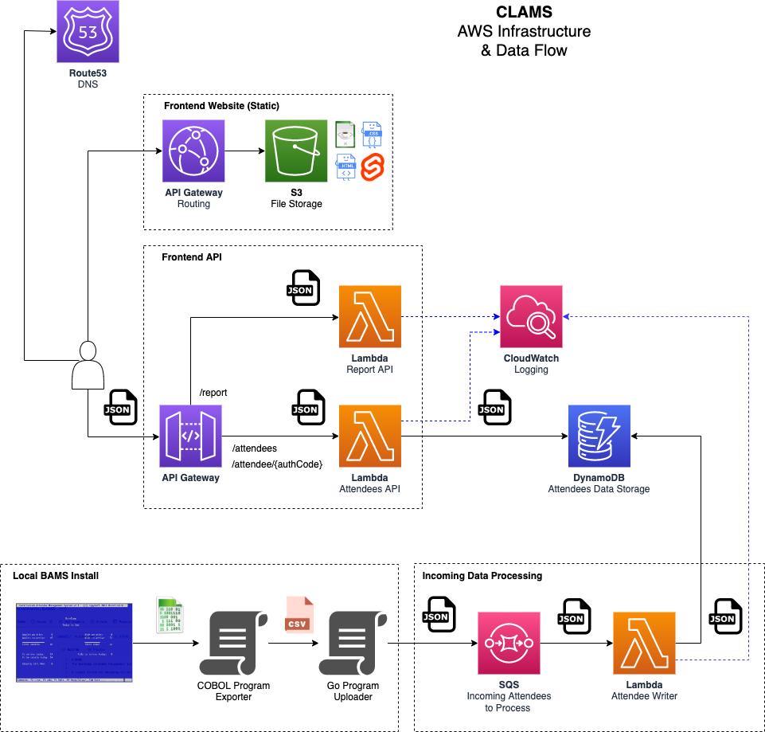

# CLAMS

_CLAMS => "BAMS in the Cloud"_

A personal learning project using a connection to a [legacy event management system written in COBOL (BAMS)](https://github.com/mikebharris/BAMS) as a way of illustrating serverless architectures using [Go](https://go.dev/), [Python](https://www.python.org/), [Fabric](https://www.fabfile.org/), [Svelte](https://svelte.dev/) and [Terraform](https://www.terraform.io/).  CLAMS so far employs the following AWS services:

* API Gateway
* DynamoDB
* Lambda
* S3
* SQS
* CloudFront
* Route53
* CloudWatch

## More

This is primarily a project for me to learn Go to establish and understand patterns for writing service and unit tests.

## Architecture



## Using CLAMS

To use CLAMS, get the API Gateway endpoint via AWS Console; it's also displayed as the output of the deployment script (see below).  There is an [example Postman collection](CLAMS.postman_collection.json) that you can use.  The endpoints provided are:

* /clams/attendees - fetch a list of all attendees
* /clams/attendee/5F7BCD - get a specific attendee's details (the code is for the example attendee defined in [](terraform/modules/dynamo/items.tf))
* /clams/report - fetch some statistics about the event

To upload data to CLAMS from BAMS, please see the [Uploader utility's README](uploader/README.md) and the BAMS Documentation for the [Home Screen](https://github.com/mikebharris/BAMS#home-screen)'s [Upload to CLAMS functionality](https://github.com/mikebharris/BAMS#upload-to-clams-functionality) .

# Getting AWS Credentials

In the following test and deployment sections you'll need to create a pair of credentials.  Log in to AWS console for the account you wish to use to deploy the application, go to IAM, and choose your user.  Click the _Security credentials_ tab and then the _Create access key_ button.  This will create a tuple of AWS_ACCESS_KEY_ID and AWS_SECRET_ACCESS_KEY for you.  You'll need these shortly.   Note you can only create two credentials tuples per IAM user, and once you accept you'll not longer be able to view the AWS_SECRET_ACCESS_KEY.  For utmost security delete these at the end of a session and recreate them at the next. 

# The Components

## Lambdas

There are three AWS Lambda functions:

* [Attendee Writer](functions/attendee-writer) - Writes new incoming attendees into the DynamoDB datastore
* [Attendee API](functions/attendees-api) - Presents the attendee's details to the world in JSON
* [Report API](functions/report-api) - Does some calculations and presents data to the world in JSON

## Shared packages

As an example of shared packages, these Lambda functions all use the shared _attendee_ package located in [](attendee).  This can be used in your own programs thus:

```go
package main

import (
	"fmt"
	"github.com/mikebharris/CLAMS/attendee"
)

func main() {
	awsConfig, _ := newAwsConfig("us-east-1")
	store := attendee.AttendeesStore{Db: dynamodb.NewFromConfig(*awsConfig), Table: "the-attendee-table"}
	attendees, _ := store.GetAllAttendees(context.Background())
	for i, a := range attendees {
		fmt.Printf("Attendee number %d is known as %s\n", i, a.Name)
	}
}
```

## Other files

The Terraform configuration files are in the [](terraform) directory, the frontend (hastily built in Svelte) is built in [](frontend), and [](uploader) containw the utility, which can be called from within [BAMS](https://github.com/mikebharris/), to upload the latest group of attendees to SQS.

# Running Tests

There are service/integration-level tests that use Gherkin syntax to test integration between the Lambda and other dependent AWS servies.  The tests make use of Docker containers to emulate the various services locally, and therefore you need Docker Desktop running.

To run the service tests, change to the service in the _functions_ directory and type:

```shell
AWS_SECRET_ACCESS_KEY=x AWS_ACCESS_KEY_ID=y make int-test
```

There are unit tests than can be run, again by changing to the service in the _functions_ directory and typing:

```shell
make unit-test
```

You can run both unit and integration/service tests for a given service with:

```shell
make test
```

# Deploying

There is a Python Fabric 2 script to help you do this.  First authenticate with AWS, either using a SSO integration tool such as XXXX, or by fetching your credentials from IAM.

First time you'll need to run the _init_ process (for example):

```shell
AWS_ACCESS_KEY_ID=XXXX AWS_SECRET_ACCESS_KEY=YYYY fab terraform --account-number=111111111111 --contact=your@email.com --mode=init
```

A _plan_ tests your Terraform config's syntax:

```shell
AWS_ACCESS_KEY_ID=XXXX AWS_SECRET_ACCESS_KEY=YYYY fab terraform --account-number=111111111111 --contact=your@email.com --mode=plan
```

An _apply_ makes your changes so in your target AWS account:
```shell
AWS_ACCESS_KEY_ID=XXXX AWS_SECRET_ACCESS_KEY=YYYY fab terraform --account-number=111111111111 --contact=your@email.com --mode=apply
```

And finally _destroy_ takes it all down again:
```shell
AWS_ACCESS_KEY_ID=XXXX AWS_SECRET_ACCESS_KEY=YYYY fab terraform --account-number=111111111111 --contact=your@email.com --mode=destroy
```

The command line supports the following:

```shell
Usage: fab [--core-opts] terraform [--options] [other tasks here ...]

Docstring:
  none

Options:
  -a STRING, --account-number=STRING
  -c STRING, --contact=STRING
  -d STRING, --distribution-bucket=STRING
  -e STRING, --environment=STRING
  -i STRING, --input-queue=STRING
  -m STRING, --mode=STRING
  -p STRING, --project-name=STRING
  -r STRING, --region=STRING
  -t STRING, --attendees-table=STRING
```

# TODO list

* Write a better front-end
* Add authentication to the API
