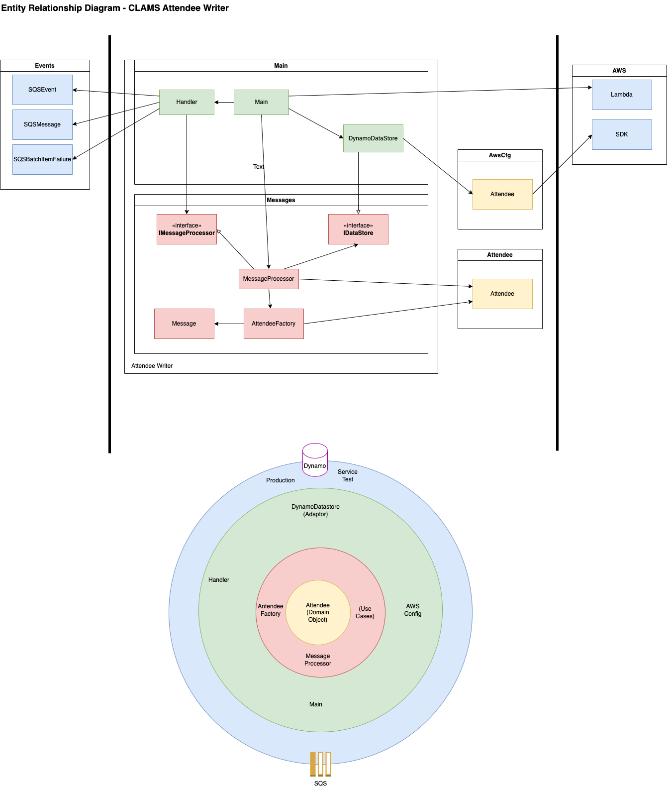

# CLAMS - The Cloud-based Lightweight Attendee Management System

_CLAMS ~= "BAMS in the Cloud"_

A personal learning project using a connection to a [legacy event management system written in COBOL (BAMS)](https://github.com/mikebharris/BAMS) as a way of illustrating serverless architectures using [Go](https://go.dev/), [Svelte](https://svelte.dev/) and [Terraform](https://www.terraform.io/).  CLAMS so far employs the following AWS services:

* API Gateway
* DynamoDB
* Lambda
* S3
* SQS
* CloudFront
* Route53
* CloudWatch
* RDS

## More details

This is primarily a project for me to learn Go to establish and understand patterns for writing service and unit tests.  It was used as the basis for a workshop on AWS and its services that I first did in Todmorden in June 2022 for [HacktionLab](https://hacktionlab.org).

In the project I also attempt to use best practices around:

* __Test driven development__ using the stubs, spies and mocks library for unit tests, with extensive reworking to make the tests more refactor proof and test behaviour and not implementation, thanks to input from Hoegrammer.
* __Behavioural driven development__ tests using Godog with acceptance-test feature files written in Gherkin
* __Clean code__ - naming of methods, variables, tests, packages, etc.
* __SOLID__ (where possible given that Go is a little unusual as an OO language preferring, as it does, composition through _structural typing_ over inheritance)
* __Design__ patterns
* __Moduliarisation__ of Go code using packages
* __Infrastructure__ as code and devops approaches using Fabric and Terraform

## Architecture


### Entity Relationships



## Using CLAMS

To use CLAMS, hit the API Gateway endpoint via AWS Console; it's also displayed as the output of the deployment script (see below).  There is an [example Postman collection](CLAMS.postman_collection.json) that you can use.  The endpoints provided are:

* /clams/attendees - fetch a list of all attendees
* /clams/attendee/5F7BCD - get a specific attendee's details (the code is for the example attendee defined in [](terraform/modules/dynamo/items.tf))
* /clams/report - fetch some statistics about the event

To upload data to CLAMS from BAMS, please see the [Uploader utility's README](uploader/README.md) and the BAMS Documentation for the [Home Screen](https://github.com/mikebharris/BAMS#home-screen)'s [Upload to CLAMS functionality](https://github.com/mikebharris/BAMS#upload-to-clams-functionality) .

# Getting AWS Credentials

In the following test and deployment sections you'll need to create a pair of credentials.  Log in to AWS console for the account you wish to use to deploy the application, go to IAM, and choose your user.  Click the _Security credentials_ tab and then the _Create access key_ button.  This will create a tuple of AWS_ACCESS_KEY_ID and AWS_SECRET_ACCESS_KEY for you.  You'll need these shortly.   Note you can only create two credentials tuples per IAM user, and once you accept you'll not longer be able to view the AWS_SECRET_ACCESS_KEY.  For utmost security delete these at the end of a session and recreate them at the next. 

# The Components

## Lambdas

There are five AWS Lambda functions:

* [Attendee Writer](lambdas/attendee-writer) - Writes new incoming attendees into the DynamoDB datastore
* [Attendee API](lambdas/attendees-api) - Presents the attendee's details to the world and does some reporting in JSON
* [Authorizer](lambdas/authorizer) - Provides HTTP Basic Auth access to certain endpoints (i.e. for PUT, POST, DELETE)
* [DB-Trigger](lambdas/db-trigger) - Turns entries in the trigger_notifications table into streamed events
* [Processor](lambdas/processor) - Process db notifications created by the DB-Trigger Lambda

## Shared packages

As an example of a packages shared between multiple Lambda.  The Lambda functions all use the shared _attendee_ and _awscfg_ packages located in the same parent directory as the Lambdas themselves.  This can be used in your own programs along the lines of:

```go
package main

import (
	"fmt"
	"github.com/mikebharris/CLAMS/functions/attendee"
)

func main() {
	a := attendee.Attendee{
		AuthCode:       "ABCDEF",
		Name:           "Frank Ostrowski",
		Email:          "frank.o@gfa.de",
		Telephone:      "0101 0101 01010",
		NumberOfKids:   0,
		Diet:           "I eat BASIC code for lunch",
		Financials:     attendee.Financials{AmountToPay: 10, AmountPaid: 10, AmountDue: 0},
		ArrivalDay:     "Wednesday",
		NumberOfNights: 4,
		StayingLate:    "No",
		CreatedTime:    time.Now(),
	}

	fmt.Println(a)
}
```

## Other files

The Terraform configuration files are in the [](terraform) directory, the frontend (hastily built in Svelte) is built in [](frontend), and [](uploader) contains a utility to upload the latest group of attendees to SQS.  It can be run on the command line or called from within [BAMS](https://github.com/mikebharris/).

The Database is deployed using Flyway (both to AWS and into a Docker instance for the Service Tests).  The command that is run can be found in [](fabfile.py) and the SQL migration (scheme version) files in [](flyway/sql)

# Building

To build the Lambdas, change to the service in the _lambdas_ directory and type:

```shell
make build
```

To build the Lambda for the target AWS environment, which may have a different processor architecture from your local development, type:

```shell
make target
```

This is normally because, for example, you are developing on an Intel Mac but deploying to an ARM64 AWS Lambda environment.

# Running Tests

There are integration tests (aka service tests) that use Gherkin syntax to test integration between the Lambda and other dependent AWS services.  The tests make use of Docker containers to emulate the various services locally, and therefore you need Docker running.

The integration tests use another GitHub project of mine, [Test Container Network for Go](https://github.com/mikebharris/testcontainernetwork-go), which wraps the creation and manipulation of a network of Docker containers for common services in a set of helper routines to reduce the quantity of boilerplate code whilst maintaining the ability to test-drive their development. 

To run the integration tests, change to the service in the _lambdas_ directory and type:

```shell
make int-test
```

Alternatively, you can change to the integration-tests directory and type:

```shell
cd lambdas/processor/integration-tests
go test
```

There are unit tests than can be run, again by changing to the service in the _functions_ directory and typing:

```shell
make unit-test
```

You can run both unit and integration tests for a given service with:

```shell
make test
```

# Deploying
There is a [Go program](pipeline.go) that _helps_ you to build and test the Lambdas and run Terraform commands included in the repository. This
program takes the following parameters:

```shell
go run pipeline.go --help
Usage of pipeline:
  -account-number uint
    	Account number of AWS deployment target
  -confirm 
    	For destructive operations this should be set to true rather than false
  -environment string
    	Target environment = prod, nonprod, etc (default "nonprod")
  -lambdas string
    	Which Lambda functions to test and/or build: <name-of-lambda> or all (default "all")
  -stage string
    	Deployment stage: unit-test, build, int-test, init, plan, apply, destroy
```

The _--stage_ parameter allows you to control each distinct stage of a pipeline deployment process, locally on your development machine, or in each stage of the pipeline:

* unit-test - Run suite of unit tests for all Lambdas
* build - Build all Lambdas for target environment
* int-test - Run suite of integration tests for all Lambdas
* init - Initialise Terraform
* plan - Run Terraform plan
* apply - Run Terraform apply
* destroy - Run Terraform destroy

## Prerequisites

The RDS database for CLAM requires two SSM parameters to be set up in the AWS Parameter Store.  Create these as /clams/{environment}/db/username and /clams/{environment}/db/password replacing {environment} with your target environment, for example:

* /clams/nonprod/db/username
* /clams/nonprod/db/password

Both should ideally be of type SecureString, though it doesn't matter to the deployment scripts.

The Route53 record requires an SSL certificate to be created using Amazon Certificate Manager (ACM).

### Running the Go pipeline deployment helper program

Each deployment stage is now described in detail

#### unit-test

This runs all the unit tests for all the Lambdas:
```shell
go run pipeline.go --stage=unit-test
```

Optionally you can unit test just a single Lambda by using the _--lambda__ flag on the command line:
```shell
go run pipeline.go --stage=unit-test --lambda=processor
```

#### build

This builds all the Lambdas:
```shell
go run pipeline.go --stage=build
```

Optionally you can build just a single Lambda by using the _--lambda__ flag on the command line:
```shell
go run pipeline.go --stage=build --lambda=processor
```

#### int-test

This runs all the integration tests for all the Lambdas:
```shell
go run pipeline.go --stage=int-test
```

Optionally you can run integration tests for just a single Lambda by using the _--lambda__ flag on the command line:
```shell
go run pipeline.go --stage=int-test --lambda=processor
```

#### init

Run Terraform init:
```shell
AWS_ACCESS_KEY_ID=XXXX AWS_SECRET_ACCESS_KEY=YYYY go run pipeline.go --stage=init --account-number=123456789012 --environment=nonprod 
```

#### plan

Run Terraform plan:
```shell
AWS_ACCESS_KEY_ID=XXXX AWS_SECRET_ACCESS_KEY=YYYY go run pipeline.go --stage=plan --account-number=123456789012 --environment=nonprod 
```

#### apply

Run Terraform apply:
```shell
AWS_ACCESS_KEY_ID=XXXX AWS_SECRET_ACCESS_KEY=YYYY go run pipeline.go --stage=apply --account-number=123456789012 --environment=nonprod --confirm=true
```

#### destroy

Run Terraform destroy:
```shell
AWS_ACCESS_KEY_ID=XXXX AWS_SECRET_ACCESS_KEY=YYYY go run pipeline.go --stage=destroy --account-number=123456789012 --environment=nonprod --confirm=true
```


### FAQ

#### I get "Backend configuration changed" whilst initialising or another operation

You get an error similar to the following:

```shell
$ go run pipeline.go --stage=init --account-number=123456789012 --environment=prod
2024/01/16 16:30:06 error running Init: exit status 1

Error: Backend configuration changed
```

This is normally due to switching between environments and caused by your local Terraform tfstate file being out-of-sync
with the remote tfstate file in S3. You can resolve it by removing the directory `terraform/.terraform` and re-running
the _init_ process.

# TODO list

* Write a better front-end
* Add authentication to the API
* Add Kitchen reporter utility
* Add ability to write new attendees to database
* Add ability to synch bi-directionally between BAMS and CLAMS
* Add ability to handle GDPR Requests-for-Erasure (RfE)
