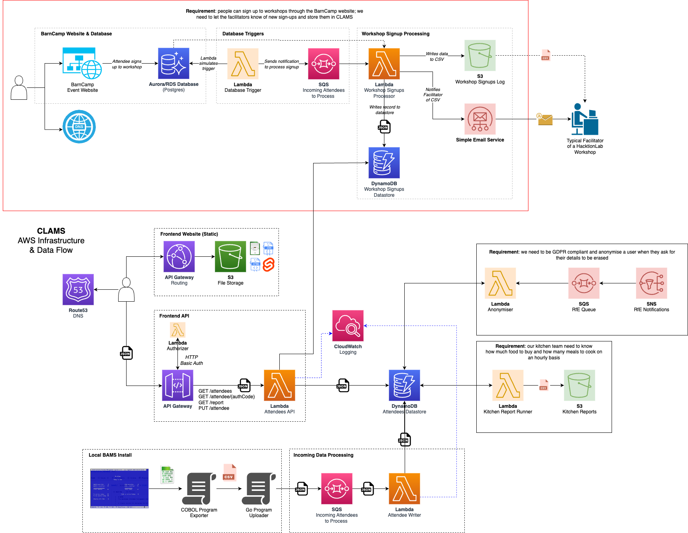

# CLAMS

_CLAMS => "BAMS in the Cloud"_

A personal learning project using a connection to a legacy event management system as a way of illustrating serverless architectures using Go, Python, Fabric, Svelte and Terraform.  CLAMS so far employs the following AWS services:

* API Gateway
* DynamoDB
* Lambda
* S3
* SQS
* CloudFront
* Route53
* CloudWatch

## Architecture



## Using CLAMS

To use CLAMS, get the API Gateway endpoint via AWS Console; it's also displayed as the output of the deployment script (see below).  There is an [example Postman collection](CLAMS.postman_collection.json) that you can use.  The endpoints provided are:

* /clams/attendees - fetch a list of all attendees
* /clams/attendee/5F7BCD - get a specific attendee's details (the code is for the example attendee defined in [](terraform/modules/dynamo/items.tf))
* /clams/report - fetch some statistics about the event

To upload data to CLAMS from BAMS, please see the [Uploader utility's README](uploader/README.md) and the BAMS Documentation for the [Home Screen](https://github.com/mikebharris/BAMS#home-screen)'s [Upload to CLAMS functionality](https://github.com/mikebharris/BAMS#upload-to-clams-functionality) .

# Running Tests

There are service/integration-level tests that use Gherkin syntax to test integration between the Lambda and other dependent AWS servies.  The tests make use of Docker containers to emulate the various services locally, and therefore you need Docker Desktop running.

To run the service tests, change to the service in the _functions_ directory and type:

```shell
AWS_SECRET_ACCESS_KEY=x AWS_ACCESS_KEY_ID=y make int-test
```

# Deploying

There is a Python Fabric 2 script to help you do this.  First authenticate with AWS, either using a SSO integration tool such as XXXX, or by fetching your credentials from IAM.

First time you'll need to run the _init_ process (for example):

```shell
AWS_ACCESS_KEY_ID=XXXX AWS_SECRET_ACCESS_KEY=YYYY fab terraform --account-number=111111111111 --contact=your@email.com --mode=init
```

A _plan_ tests your Terraform config's syntax:

```shell
AWS_ACCESS_KEY_ID=XXXX AWS_SECRET_ACCESS_KEY=YYYY fab terraform --account-number=111111111111 --contact=your@email.com --mode=plan
```

An _apply_ makes your changes so in your target AWS account:
```shell
AWS_ACCESS_KEY_ID=XXXX AWS_SECRET_ACCESS_KEY=YYYY fab terraform --account-number=111111111111 --contact=your@email.com --mode=apply
```

And finally _destroy_ takes it all down again:
```shell
AWS_ACCESS_KEY_ID=XXXX AWS_SECRET_ACCESS_KEY=YYYY fab terraform --account-number=111111111111 --contact=your@email.com --mode=destroy
```

The command line supports the following:

```shell
Usage: fab [--core-opts] terraform [--options] [other tasks here ...]

Docstring:
  none

Options:
  -a STRING, --account-number=STRING
  -c STRING, --contact=STRING
  -d STRING, --distribution-bucket=STRING
  -e STRING, --environment=STRING
  -i STRING, --input-queue=STRING
  -m STRING, --mode=STRING
  -p STRING, --project-name=STRING
  -r STRING, --region=STRING
  -t STRING, --attendees-table=STRING
```

# TODO list

* Write a better front-end
* Add authentication to the API
